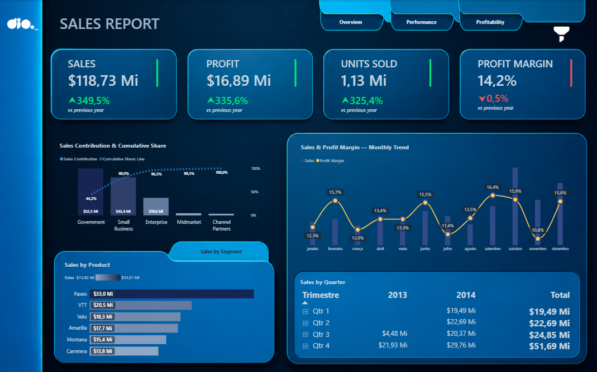
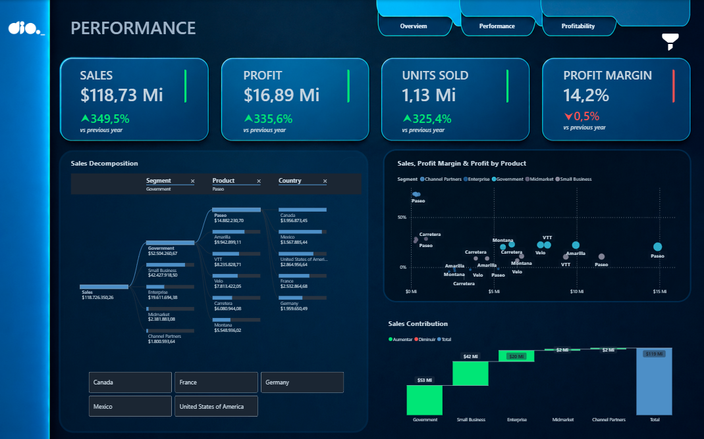
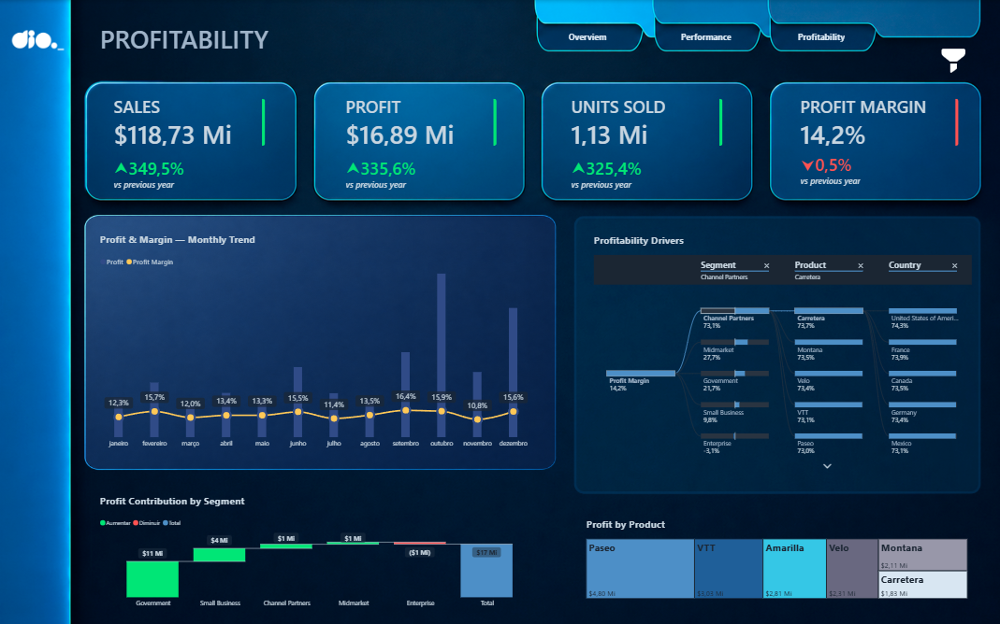

# Power BI Sales Report

Dashboard executivo desenvolvido em Power BI para análise de **vendas, performance e rentabilidade**, como parte do Desafio de Projeto da DIO.

## 📊 Visão geral

O projeto foi estruturado em três páginas principais:

### 1. Overview
Visão executiva dos principais indicadores comerciais, permitindo acompanhar:

- Sales
- Profit
- Units Sold
- Profit Margin
- Contribuição das vendas
- Participação acumulada
- Evolução mensal
- Vendas por produto
- Vendas por trimestre



### 2. Performance
Análise da performance comercial e dos principais direcionadores de vendas.

Principais análises:

- Decomposição das vendas
- Sales × Profit Margin
- Performance por segmento, produto e país
- Contribuição dos segmentos para as vendas
- Análise hierárquica dos resultados



### 3. Profitability
Análise focada em rentabilidade e seus principais drivers.

Principais análises:

- Profit & Profit Margin por mês
- Contribuição dos segmentos para o lucro
- Profit por produto
- Drivers de rentabilidade por segmento, produto e país
- Evolução da margem ao longo do período



## 🛠️ Tecnologias e recursos

- Power BI
- Power Query
- DAX
- Modelagem de dados
- KPIs
- Drill-down
- Segmentações e filtros
- Navegação entre páginas
- Tooltips
- Visualizações interativas

## 🎯 Objetivo

Construir um dashboard executivo capaz de transformar dados de vendas em informações para **análise de desempenho, identificação de oportunidades e acompanhamento da rentabilidade**.

O projeto também buscou aplicar princípios de organização visual, hierarquia de informação e consistência de identidade visual para facilitar a leitura dos indicadores.

## 📁 Estrutura do projeto

```text
power-bi-sales-report/
│
├── dashboard/
│   └── Sales_Report.pbix
│
├── screenshots/
│   ├── 01-overview.png
│   ├── 02-performance.png
│   └── 03-profitability.png
│
└── README.md
